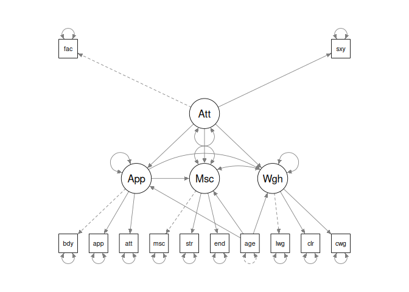

<!-- README.md is generated from README.Rmd. Please edit that file 
use devtools::build_readme() to update README.md-->

# rmedsem <a href="https://ihrke.github.io/rmedsem/"></a>

<!-- badges: start -->
<!-- badges: end   -->

The goal of rmedsem is to conduct a mediation analysis based on a
structural equation model (SEM), including observed and/or latent
variables as well as combination of observed and latent variables. The
package supports:

- covariance-based SEM estimated with the
  [lavaan](https://lavaan.ugent.be/) package
- PLS-SEM estimated using [cSEM](https://m-e-rademaker.github.io/cSEM/)
- Bayesian SEM estimated using
  [blavaan](https://ecmerkle.github.io/blavaan/index.html)

The `rmedsem` package also supports estimating [moderated mediation and
mediated moderation](articles/moderated_mediation.html) models using the
[modsem](https://modsem.org) package.

Currently, only continuous independent and mediator variables are
supported. See [this article](articles/mediation_technical.html) for
technical details on the estimation procedure used.

See the examples in the section below and refer to the `rmedsem()`
documentation. Examples covering the different estimation methods
(CB-SEM, PLS-SEM, Bayesian SEM) are detailed in [this
article](articles/estimation_methods.html).

## Installation

You can install the development version of rmedsem from
[GitHub](https://github.com/) with:

``` r
# install.packages("devtools")
devtools::install_github("ihrke/rmedsem")
```

## Getting started

We start with a simple example using the `hsbdemo` dataset included in
`rmedsem`. In this model, we include only observed variables and have a
simple case in which mathematical skills `math` directly affect
performance in science-related areas `science` and where part of this
association is mediated thrugh their abiliy to `read`.

<div class="grViz html-widget html-fill-item" id="htmlwidget-f5ce67fdaded799d734a" style="width:100%;height:480px;"></div>
<script type="application/json" data-for="htmlwidget-f5ce67fdaded799d734a">{"x":{"diagram":"\ndigraph {\n  rankdir=LR;\n    math -> read;\n    read -> science;\n    math -> science;\n}","config":{"engine":"dot","options":null}},"evals":[],"jsHooks":[]}</script>

We can express this model in `lavaan` syntax as follows:

``` r
mod.txt <- "
  read ~ math
  science ~ read + math
"
```

Once specified, we can use `lavaan` to fit the model using CB-SEM:

``` r
library(lavaan)
mod <- lavaan::sem(mod.txt, data=rmedsem::hsbdemo)
```

We can inspect the estimated coefficients using `lavaan`s methods
(`summary()` etc). To run the mediation analysis, we use `rmedsem()` and
specify the independent variable (`indep="math"`), the mediator
(`med="red"`) and the dependent variable (`dep="science"`). The output
is captured in an output object `out` which implements a printing
function (`print.rmedsem()`) to show a summary of the results:

``` r
library(rmedsem)
out <- rmedsem(mod, indep="math", med="read", dep="science")
print(out)
#> Significance testing of indirect effect (standardized)
#> Model estimated with package 'lavaan'
#> Mediation effect: 'math' -> 'read' -> 'science'
#> 
#>                         Sobel         Delta   Monte-Carlo
#> Indirect effect        0.2506        0.2506        0.2506
#> Std. Err.              0.0456        0.0456        0.0451
#> z-value                5.5006        5.5006        5.5264
#> p-value              3.79e-08      3.79e-08      3.27e-08
#> CI              [0.161, 0.34] [0.161, 0.34] [0.17, 0.351]
#> 
#> Baron and Kenny approach to testing mediation
#>    STEP 1 - 'math:read' (X -> M) with B=0.662 and p=0.000
#>    STEP 2 - 'read:science' (M -> Y) with B=0.378 and p=0.000
#>    STEP 3 - 'math:science' (X -> Y) with B=0.380 and p=0.000
#>             As STEP 1, STEP 2 and STEP 3 as well as the Sobel's test above
#>             are significant the mediation is partial.
#> 
#> Zhao, Lynch & Chen's approach to testing mediation
#> Based on p-value estimated using Monte-Carlo
#>   STEP 1 - 'math:science' (X -> Y) with B=0.380 and p=0.000
#>             As the Monte-Carlo test above is significant, STEP 1 is
#>             significant and their coefficients point in same direction,
#>             there is complementary mediation (partial mediation).
#> 
#> Effect sizes
#>    RIT = (Indirect effect / Total effect)
#>          (0.251/0.631) = 0.397
#>          Meaning that about  40% of the effect of 'math'
#>          on 'science' is mediated by 'read'
#>    RID = (Indirect effect / Direct effect)
#>          (0.251/0.380) = 0.659
#>          That is, the mediated effect is about 0.7 times as
#>          large as the direct effect of 'math' on 'science'
```

The result reports the estimated indirect effect using the Sobel, Delta
and Monte-Carlo methods (see [technical
details](articles/mediation_technical.html)) and also explains the
Baron-Kenny procedure in detail.

We can switch to an alternative method by Zhao, Lynch & Chen (2010)
using the `approach="zlc"` option (here we also switched to standardized
coefficients using `standardized=T`):

``` r
rmedsem(mod, indep="math", med="read", dep="science",
        standardized=T, approach = "zlc")
#> Significance testing of indirect effect (standardized)
#> Model estimated with package 'lavaan'
#> Mediation effect: 'math' -> 'read' -> 'science'
#> 
#>                         Sobel         Delta    Monte-Carlo
#> Indirect effect        0.2506        0.2506         0.2506
#> Std. Err.              0.0456        0.0456         0.0458
#> z-value                5.5006        5.5006         5.3890
#> p-value              3.79e-08      3.79e-08       7.09e-08
#> CI              [0.161, 0.34] [0.161, 0.34] [0.159, 0.334]
#> 
#> Zhao, Lynch & Chen's approach to testing mediation
#> Based on p-value estimated using Monte-Carlo
#>   STEP 1 - 'math:science' (X -> Y) with B=0.380 and p=0.000
#>             As the Monte-Carlo test above is significant, STEP 1 is
#>             significant and their coefficients point in same direction,
#>             there is complementary mediation (partial mediation).
#> 
#> Effect sizes
#>    RIT = (Indirect effect / Total effect)
#>          (0.251/0.631) = 0.397
#>          Meaning that about  40% of the effect of 'math'
#>          on 'science' is mediated by 'read'
#>    RID = (Indirect effect / Direct effect)
#>          (0.251/0.380) = 0.659
#>          That is, the mediated effect is about 0.7 times as
#>          large as the direct effect of 'math' on 'science'
```

We can also apply `rmedsem()` to more complex SEM’s that contain both
latent and observed variables:

``` r
model03 <- "
   Attractive =~ face + sexy
   Appearance =~ body + appear + attract
   Muscle =~ muscle + strength + endur
   Weight =~ lweight + calories + cweight
   Appearance ~ Attractive + age
   Muscle ~ Appearance + Attractive + age
   Weight ~ Appearance + Attractive + age
"
mod <- sem(model03, data=rmedsem::workout)
```


Here, we have latent variables `Appearance`, `Attractiveness`, `Muscle`
and `Weight` that measure the motivation of people going to a gym to
workout.

This model features several complex mediation pathways. We can use
`rmedsem()` to investigate those one by one. We start by considering the
pathway `Attractive` -\> `Appearance` -\> `Muscle` (the more attractive
the person perceives her/himself, the more this will indirectly
influence her/him to want to work out more to build up muscles):

``` r
rmedsem(mod, indep="Attractive", med="Appearance", dep="Muscle",
        approach = c("bk","zlc"))
#> Significance testing of indirect effect (standardized)
#> Model estimated with package 'lavaan'
#> Mediation effect: 'Attractive' -> 'Appearance' -> 'Muscle'
#> 
#>                            Sobel              Delta     Monte-Carlo
#> Indirect effect           0.0654             0.0654          0.0654
#> Std. Err.                 0.0331             0.0338          0.0336
#> z-value                   1.9748             1.9359          2.0549
#> p-value                   0.0483             0.0529          0.0399
#> CI              [0.000491, 0.13] [-0.000814, 0.132] [0.0113, 0.136]
#> 
#> Baron and Kenny approach to testing mediation
#>    STEP 1 - 'Attractive:Appearance' (X -> M) with B=0.158 and p=0.033
#>    STEP 2 - 'Appearance:Muscle' (M -> Y) with B=0.414 and p=0.000
#>    STEP 3 - 'Attractive:Muscle' (X -> Y) with B=-0.014 and p=0.850
#>             As STEP 1, STEP 2 and the Sobel's test above are significant
#>             and STEP 3 is not significant the mediation is complete.
#> 
#> Zhao, Lynch & Chen's approach to testing mediation
#> Based on p-value estimated using Monte-Carlo
#>   STEP 1 - 'Attractive:Muscle' (X -> Y) with B=-0.014 and p=0.850
#>             As the Monte-Carlo test above is significant and STEP 1 is not
#>             significant there indirect-only mediation (full mediation).
#> 
#> Effect sizes
#>    WARNING: Total effect is smaller than indirect effect!
#>             Effect sizes should not be interpreted.
#>    RIT = (Indirect effect / Total effect)
#>          Total effect 0.052 is too small to calculate RIT
#>    RID = (Indirect effect / Direct effect)
#>          (0.065/0.014) = 4.714
#>          That is, the mediated effect is about 4.7 times as
#>          large as the direct effect of 'Attractive' on 'Muscle'
```

Similarly, we could investigate the pathway `Attractive` -\>
`Appearance` -\> `Weight` (the more attractive the person perceives
her/himself, the more this will indirectly influence her/him to want to
work out more to lose weight):

``` r
rmedsem(mod, indep="Attractive", med="Appearance", dep="Weight",
        approach = "zlc")
#> Significance testing of indirect effect (standardized)
#> Model estimated with package 'lavaan'
#> Mediation effect: 'Attractive' -> 'Appearance' -> 'Weight'
#> 
#>                           Sobel            Delta     Monte-Carlo
#> Indirect effect          0.0979           0.0979          0.0979
#> Std. Err.                0.0470           0.0484          0.0485
#> z-value                  2.0810           2.0228          2.0542
#> p-value                  0.0374           0.0431            0.04
#> CI              [0.00569, 0.19] [0.00304, 0.193] [0.0172, 0.202]
#> 
#> Zhao, Lynch & Chen's approach to testing mediation
#> Based on p-value estimated using Monte-Carlo
#>   STEP 1 - 'Attractive:Weight' (X -> Y) with B=-0.125 and p=0.073
#>             As the Monte-Carlo test above is significant and STEP 1 is not
#>             significant there indirect-only mediation (full mediation).
#> 
#> Effect sizes
#>    WARNING: Total effect is smaller than indirect effect!
#>             Effect sizes should not be interpreted.
#>    RIT = (Indirect effect / Total effect)
#>          Total effect 0.027 is too small to calculate RIT
#>    RID = (Indirect effect / Direct effect)
#>          (0.098/0.125) = 0.784
#>          That is, the mediated effect is about 0.8 times as
#>          large as the direct effect of 'Attractive' on 'Weight'
```

Note that these models involve latent variables. It is also possible to
use a combination of latent and observed variables and to use [different
packages/estimation techniques](articles/estimation_methods.html) to fit
the models.
