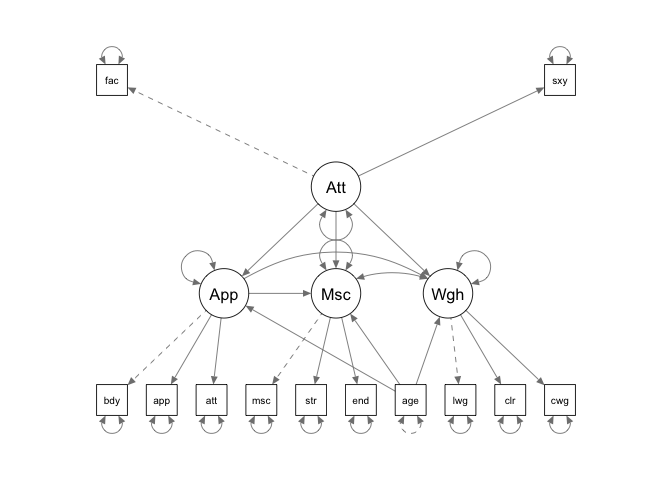

<!-- README.md is generated from README.Rmd. Please edit that file -->

# rmedsem <a href="https://ihrke.github.io/rmedsem/"></a>

<!-- badges: start -->
<!-- badges: end -->

The goal of rmedsem is to conduct a mediation analysis based on a
structural equation model (SEM), including observed and/or latent
variables as well as combination of observed and latent variables. The
package supports:

- covariance-based SEM estimated with the
  [lavaan](https://lavaan.ugent.be/) package
- PLS-SEM estimated using [cSEM](https://m-e-rademaker.github.io/cSEM/)
- Bayesian SEM estimated using
  [blavaan](https://ecmerkle.github.io/blavaan/index.html)

Currently, only continuous independent and mediator variables are
supported. See [this article](articles/mediation_technical.html) for
technical details on the estimation procedure used.

See the examples in the section below and refer to the `rmedsem()`
documentation. Examples covering the different estimation methods
(CB-SEM, PLS-SEM, Bayesian SEM) are detailed in [this
article](articles/estimation_methods.html).

## Installation

You can install the development version of rmedsem from
[GitHub](https://github.com/) with:

``` r
# install.packages("devtools")
devtools::install_github("ihrke/rmedsem")
```

## Getting started

We start with a simple example using the `hsbdemo` dataset included in
`rmedsem`. In this model, we include only observed variables and have a
simple case in which mathematical skills `math` directly affect
performance in science-related areas `science` and where part of this
association is mediated thrugh their abiliy to `read`.


We can express this model in `lavaan` syntax as follows:

``` r
mod.txt <- "
  read ~ math
  science ~ read + math
"
```

Once specified, we can use `lavaan` to fit the model using CB-SEM:

``` r
library(lavaan)
mod <- lavaan::sem(mod.txt, data=rmedsem::hsbdemo)
```

We can inspect the estimated coefficients using `lavaan`s methods
(`summary()` etc). To run the mediation analysis, we use `rmedsem()` and
specify the independent variable (`indep="math"`), the mediator
(`med="red"`) and the dependent variable (`dep="science"`). The output
is captured in an output object `out` which implements a printing
function (`print.rmedsem()`) to show a summary of the results:

``` r
library(rmedsem)
out <- rmedsem(mod, indep="math", med="read", dep="science")
print(out)
#> Significance testing of indirect effect (unstandardized)
#> Model estimated with package 'lavaan'
#> Mediation effect: 'math' -> 'read' -> 'science'
#> 
#>                          Sobel          Delta    Monte-Carlo
#> Indirect effect         0.2649         0.2649          0.265
#> Std. Err.               0.0522         0.0523          0.050
#> z-value                 5.0732         5.0597          5.334
#> p-value               3.91e-07        4.2e-07       9.61e-08
#> CI              [0.163, 0.367] [0.162, 0.367] [0.177, 0.369]
#> 
#> Baron and Kenny approach to testing mediation
#>    STEP 1 - 'math:read' (X -> M) with B=0.725 and p=0.000
#>    STEP 2 - 'read:science' (M -> Y) with B=0.365 and p=0.000
#>    STEP 3 - 'math:science' (X -> Y) with B=0.402 and p=0.000
#>             As STEP 1, STEP 2 and STEP 3 as well as the Sobel's test above
#>             are significant the mediation is partial.
#> 
#> Effect sizes
#>    RIT = (Indirect effect / Total effect)
#>          (0.265/0.667) = 0.397
#>          Meaning that about  40% of the effect of 'math'
#>          on 'science' is mediated by 'read'
#>    RID = (Indirect effect / Direct effect)
#>          (0.265/0.402) = 0.659
#>          That is, the mediated effect is about 0.7 times as
#>          large as the direct effect of 'math' on 'science'
```

The result reports the estimated indirect effect using the Sobel, Delta
and Monte-Carlo methods (see [technical
details](articles/mediation_technical.html)) and also explains the
Baron-Kenny procedure in detail.

We can switch to an alternative method by Zhao, Lynch & Chen (2010)
using the `approach="zlc"` option (here we also switched to standardized
coefficients using `standardized=T`):

``` r
rmedsem(mod, indep="math", med="read", dep="science",
        standardized=T, approach = "zlc")
#> Significance testing of indirect effect (standardized)
#> Model estimated with package 'lavaan'
#> Mediation effect: 'math' -> 'read' -> 'science'
#> 
#>                         Sobel         Delta    Monte-Carlo
#> Indirect effect        0.2506        0.2506         0.2506
#> Std. Err.              0.0456        0.0456         0.0461
#> z-value                5.5006        5.4935         5.3949
#> p-value              3.79e-08      3.94e-08       6.86e-08
#> CI              [0.161, 0.34] [0.161, 0.34] [0.171, 0.351]
#> 
#> Zhao, Lynch & Chen's approach to testing mediation
#> Based on p-value estimated using Monte-Carlo
#>   STEP 1 - 'math:science' (X -> Y) with B=0.380 and p=0.000
#>             As the Monte-Carlo test above is significant, STEP 1 is
#>             significant and their coefficients point in same direction,
#>             there is complementary mediation (partial mediation).
#> 
#> Effect sizes
#>    RIT = (Indirect effect / Total effect)
#>          (0.251/0.631) = 0.397
#>          Meaning that about  40% of the effect of 'math'
#>          on 'science' is mediated by 'read'
#>    RID = (Indirect effect / Direct effect)
#>          (0.251/0.380) = 0.659
#>          That is, the mediated effect is about 0.7 times as
#>          large as the direct effect of 'math' on 'science'
```

We can also apply `rmedsem()` to more complex SEM’s that contain both
latent and observed variables:

``` r
model03 <- "
   Attractive =~ face + sexy
   Appearance =~ body + appear + attract
   Muscle =~ muscle + strength + endur
   Weight =~ lweight + calories + cweight
   Appearance ~ Attractive + age
   Muscle ~ Appearance + Attractive + age
   Weight ~ Appearance + Attractive + age
"
mod <- sem(model03, data=rmedsem::workout)
```


Here, we have latent variables `Appearance`, `Attractiveness`, `Muscle`
and `Weight` that measure the motivation of people going to a gym to
workout.

This model features several complex mediation pathways. We can use
`rmedsem()` to investigate those one by one. We start by considering the
pathway `Attractive` -\> `Appearance` -\> `Muscle` (the more attractive
the person perceives her/himself, the more this will indirectly
influence her/him to want to work out more to build up muscles):

``` r
rmedsem(mod, indep="Attractive", med="Appearance", dep="Muscle",
        approach = c("bk","zlc"))
#> Significance testing of indirect effect (unstandardized)
#> Model estimated with package 'lavaan'
#> Mediation effect: 'Attractive' -> 'Appearance' -> 'Muscle'
#> 
#>                            Sobel            Delta     Monte-Carlo
#> Indirect effect           0.1196           0.1196          0.1196
#> Std. Err.                 0.0589           0.0601          0.0528
#> z-value                   2.0305           1.9909          2.2569
#> p-value                   0.0423           0.0465           0.024
#> CI              [0.00416, 0.235] [0.00186, 0.237] [0.0287, 0.223]
#> 
#> Baron and Kenny approach to testing mediation
#> 
#> Zhao, Lynch & Chen's approach to testing mediation
#> Based on p-value estimated using Monte-Carlo
#>   STEP 1 - 'Attractive:Muscle' (X -> Y) with B=-0.025 and p=0.850
#>             As the Monte-Carlo test above is significant and STEP 1 is not
#>             significant there indirect-only mediation (full mediation).
#> 
#> Effect sizes
#>    RIT = (Indirect effect / Total effect)
#>          (0.120/0.094) = 1.269
#>          Meaning that about 127% of the effect of 'Attractive'
#>          on 'Muscle' is mediated by 'Appearance'
#>    RID = (Indirect effect / Direct effect)
#>          (0.120/0.025) = 4.714
#>          That is, the mediated effect is about 4.7 times as
#>          large as the direct effect of 'Attractive' on 'Muscle'
```

Similarly, we could investigate the pathway `Attractive` -\>
`Appearance` -\> `Weight` (the more attractive the person perceives
her/himself, the more this will indirectly influence her/him to want to
work out more to lose weight):

``` r
rmedsem(mod, indep="Attractive", med="Appearance", dep="Weight",
        approach = "zlc")
#> Significance testing of indirect effect (unstandardized)
#> Model estimated with package 'lavaan'
#> Mediation effect: 'Attractive' -> 'Appearance' -> 'Weight'
#> 
#>                           Sobel           Delta     Monte-Carlo
#> Indirect effect           0.224           0.224           0.224
#> Std. Err.                 0.103           0.104           0.104
#> z-value                   2.177           2.158           2.110
#> p-value                  0.0295          0.0309          0.0349
#> CI              [0.0223, 0.425] [0.0205, 0.427] [0.0344, 0.438]
#> 
#> Zhao, Lynch & Chen's approach to testing mediation
#> Based on p-value estimated using Monte-Carlo
#>   STEP 1 - 'Attractive:Weight' (X -> Y) with B=-0.285 and p=0.057
#>             As the Monte-Carlo test above is significant and STEP 1 is not
#>             significant there indirect-only mediation (full mediation).
#> 
#> Effect sizes
#>    RIT = (Indirect effect / Total effect)
#>          (0.224/0.062) = 3.628
#>          Meaning that about 363% of the effect of 'Attractive'
#>          on 'Weight' is mediated by 'Appearance'
#>    RID = (Indirect effect / Direct effect)
#>          (0.224/0.285) = 0.784
#>          That is, the mediated effect is about 0.8 times as
#>          large as the direct effect of 'Attractive' on 'Weight'
```

Note that these models involve latent variables. It is also possible to
use a combination of latent and observed variables and to use [different
packages/estimation techniques](articles/estimation_methods.html) to fit
the models.
