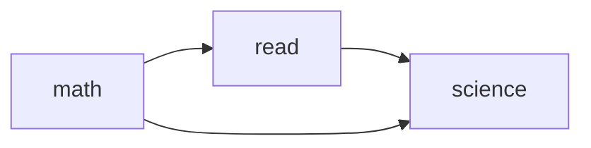
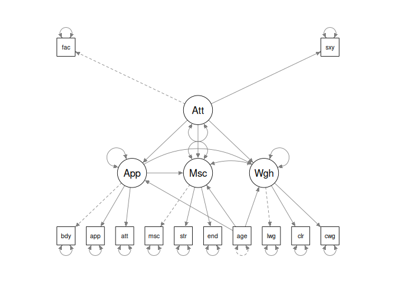

<!-- README.md is generated from README.Rmd. Please edit that file 
use devtools::build_readme() to update README.md-->

# rmedsem <a href="https://ihrke.github.io/rmedsem/"></a>

<!-- badges: start -->

[](https://CRAN.R-project.org/package=rmedsem)
[](https://github.com/ihrke/rmedsem/actions/workflows/R-CMD-check.yaml)
[](https://ihrke.github.io/rmedsem/)
<!-- badges: end   -->

The goal of rmedsem is to conduct a mediation analysis based on a
structural equation model (SEM), including observed and/or latent
variables as well as combination of observed and latent variables. The
package supports:

- covariance-based SEM estimated with the
  [lavaan](https://lavaan.ugent.be/) package
- PLS-SEM estimated using
  [cSEM](https://cran.r-project.org/package=cSEM) or
  [plssem](https://cran.r-project.org/package=plssem)
- Bayesian SEM estimated using
  [blavaan](https://cran.r-project.org/package=blavaan)

The `rmedsem` package also supports estimating [moderated mediation and
mediated
moderation](https://ihrke.github.io/rmedsem/articles/moderated_mediation.html)
models using the [modsem](https://modsem.org) package.

Currently, only continuous independent and mediator variables are
supported. See [this
article](https://ihrke.github.io/rmedsem/articles/mediation_technical.html)
for technical details on the estimation procedure used.

See the examples in the section below and refer to the `rmedsem()`
documentation. Examples covering the different estimation methods
(CB-SEM, PLS-SEM, Bayesian SEM) are detailed in [this
article](https://ihrke.github.io/rmedsem/articles/estimation_methods.html).

## Installation

You can install the released version of rmedsem from
[CRAN](https://CRAN.R-project.org/package=rmedsem) with:

``` r
install.packages("rmedsem")
```

The development version can be installed from
[GitHub](https://github.com/ihrke/rmedsem) with:

``` r
# install.packages("pak")
pak::pak("ihrke/rmedsem")
```

## Getting started

We start with a simple example using the `hsbdemo` dataset included in
`rmedsem`. In this model, we include only observed variables and have a
simple case in which mathematical skills `math` directly affect
performance in science-related areas `science` and where part of this
association is mediated through their ability to `read`.


``` mermaid
graph LR
    math --> read
    read --> science
    math --> science
```

We can express this model in `lavaan` syntax as follows:

``` r
mod.txt <- "
  read ~ math
  science ~ read + math
"
```

Once specified, we can use `lavaan` to fit the model using CB-SEM:

``` r
library(lavaan)
mod <- lavaan::sem(mod.txt, data=rmedsem::hsbdemo)
```

We can inspect the estimated coefficients using `lavaan`s methods
(`summary()` etc). To run the mediation analysis, we use `rmedsem()` and
specify the independent variable (`indep="math"`), the mediator
(`med="read"`) and the dependent variable (`dep="science"`). The output
is captured in an output object `out` which implements a printing
function (`print.rmedsem()`) to show a summary of the results:

``` r
library(rmedsem)
out <- rmedsem(mod, indep="math", med="read", dep="science")
print(out)
#> Significance testing of indirect effect (standardized)
#> Model estimated with package 'lavaan'
#> Mediation effect: 'math' -> 'read' -> 'science'
#> 
#>                          Sobel          Delta    Monte-Carlo
#> Indirect effect          0.251          0.251          0.251
#> Std. Err.                0.046          0.046          0.047
#> z-value                  5.501          5.446          5.374
#> p-value               3.79e-08       5.15e-08       7.71e-08
#> CI              [0.161, 0.340] [0.160, 0.341] [0.160, 0.343]
#> 
#> Baron and Kenny approach to testing mediation
#>    STEP 1 - 'math' -> 'read' (X -> M) with B=0.662 and p<0.001
#>    STEP 2 - 'read' -> 'science' (M -> Y) with B=0.378 and p<0.001
#>    STEP 3 - 'math' -> 'science' (X -> Y) with B=0.380 and p<0.001
#>             As STEP 1, STEP 2 and STEP 3 as well as the Sobel's test above
#>             are significant the mediation is partial.
#> 
#> Zhao, Lynch & Chen's approach to testing mediation
#> Based on p-value estimated using Monte-Carlo
#>   STEP 1 - 'math' -> 'science' (X -> Y) with B=0.380 and p<0.001
#>             As the Monte-Carlo test above is significant, STEP 1 is
#>             significant and their coefficients point in same direction,
#>             there is complementary mediation (partial mediation).
#> 
#> Effect sizes
#>    RIT = (Indirect effect / Total effect)
#>          (0.251/0.631) = 0.397
#>          Meaning that about 40% of the effect of 'math'
#>          on 'science' is mediated by 'read'
#>    RID = (Indirect effect / Direct effect)
#>          (0.251/0.380) = 0.659
#>          That is, the mediated effect is about 0.7 times as
#>          large as the direct effect of 'math' on 'science'
#>    Upsilon (v) = Variance in Y explained indirectly by X through M
#>          v(unadj) = 0.063, v(adj) = 0.061
```

The result reports the estimated indirect effect using the Sobel, Delta
and Monte-Carlo methods (see [technical
details](https://ihrke.github.io/rmedsem/articles/mediation_technical.html))
and also explains the Baron-Kenny procedure in detail.

A compact overview of the effects, the type of mediation and the effect
sizes is provided by `summary()`:

``` r
summary(out)
#> Mediation analysis: 'math' -> 'read' -> 'science'
#> Estimated with 'lavaan' (standardized), N = 200
#> 
#> Effects (95% CI):
#>                        Estimate Std. Err. z-value  p-value Lower Upper
#> Indirect (Sobel)          0.251     0.046   5.501 3.79e-08 0.161 0.340
#> Indirect (Delta)          0.251     0.046   5.446 5.15e-08 0.160 0.341
#> Indirect (Monte-Carlo)    0.251     0.047   5.374 7.71e-08 0.160 0.343
#> Direct                    0.380     0.065         4.43e-09 0.253 0.507
#> Total                     0.631     0.037                  0.559 0.703
#> 
#> Type of mediation (significant: p < 0.05):
#>   Baron & Kenny:      partial mediation
#>   Zhao, Lynch & Chen: complementary mediation (partial mediation)
#>                       (based on Monte-Carlo test)
#> 
#> Effect sizes:
#>   RIT = 0.397
#>   RID = 0.659
#>   Upsilon = 0.061
#>   Upsilon (unadj.) = 0.063
```

The estimates can also be extracted with the usual functions,
e.g. `coef()` for the indirect, direct and total effects and `confint()`
for their intervals (see [this
article](https://ihrke.github.io/rmedsem/articles/working_with_results.html)
for more ways of working with the results, including effect sizes and
plots):

``` r
coef(out)
#>  indirect    direct     total 
#> 0.2506159 0.3801172 0.6309719
confint(out)
#>              2.5 %    97.5 %
#> indirect 0.1602372 0.3433785
#> direct   0.2531357 0.5070988
#> total    0.5588379 0.7028962
```

We can switch to an alternative method by Zhao, Lynch & Chen (2010)
using the `approach="zlc"` option (here we also switched to standardized
coefficients using `standardized=T`):

``` r
rmedsem(mod, indep="math", med="read", dep="science",
        standardized=T, approach = "zlc")
#> Significance testing of indirect effect (standardized)
#> Model estimated with package 'lavaan'
#> Mediation effect: 'math' -> 'read' -> 'science'
#> 
#>                          Sobel          Delta    Monte-Carlo
#> Indirect effect          0.251          0.251          0.251
#> Std. Err.                0.046          0.046          0.047
#> z-value                  5.501          5.446          5.351
#> p-value               3.79e-08       5.15e-08       8.76e-08
#> CI              [0.161, 0.340] [0.160, 0.341] [0.161, 0.345]
#> 
#> Zhao, Lynch & Chen's approach to testing mediation
#> Based on p-value estimated using Monte-Carlo
#>   STEP 1 - 'math' -> 'science' (X -> Y) with B=0.380 and p<0.001
#>             As the Monte-Carlo test above is significant, STEP 1 is
#>             significant and their coefficients point in same direction,
#>             there is complementary mediation (partial mediation).
#> 
#> Effect sizes
#>    RIT = (Indirect effect / Total effect)
#>          (0.251/0.631) = 0.397
#>          Meaning that about 40% of the effect of 'math'
#>          on 'science' is mediated by 'read'
#>    RID = (Indirect effect / Direct effect)
#>          (0.251/0.380) = 0.659
#>          That is, the mediated effect is about 0.7 times as
#>          large as the direct effect of 'math' on 'science'
#>    Upsilon (v) = Variance in Y explained indirectly by X through M
#>          v(unadj) = 0.063, v(adj) = 0.061
```

We can also apply `rmedsem()` to more complex SEM’s that contain both
latent and observed variables:

``` r
model03 <- "
   Attractive =~ face + sexy
   Appearance =~ body + appear + attract
   Muscle =~ muscle + strength + endur
   Weight =~ lweight + calories + cweight
   Appearance ~ Attractive + age
   Muscle ~ Appearance + Attractive + age
   Weight ~ Appearance + Attractive + age
"
mod <- sem(model03, data=rmedsem::workout)
```


Here, we have latent variables `Appearance`, `Attractiveness`, `Muscle`
and `Weight` that measure the motivation of people going to a gym to
workout.

This model features several complex mediation pathways. We can use
`rmedsem()` to investigate those one by one. We start by considering the
pathway `Attractive` -\> `Appearance` -\> `Muscle` (the more attractive
the person perceives her/himself, the more this will indirectly
influence her/him to want to work out more to build up muscles):

``` r
rmedsem(mod, indep="Attractive", med="Appearance", dep="Muscle",
        approach = c("bk","zlc"))
#> Significance testing of indirect effect (standardized)
#> Model estimated with package 'lavaan'
#> Mediation effect: 'Attractive' -> 'Appearance' -> 'Muscle'
#> 
#>                          Sobel           Delta    Monte-Carlo
#> Indirect effect          0.065           0.065          0.065
#> Std. Err.                0.033           0.033          0.034
#> z-value                  1.975           1.954          1.919
#> p-value                 0.0483          0.0507         0.0550
#> CI              [0.000, 0.130] [-0.000, 0.131] [0.005, 0.138]
#> 
#> Baron and Kenny approach to testing mediation
#>    STEP 1 - 'Attractive' -> 'Appearance' (X -> M) with B=0.158 and p=0.033
#>    STEP 2 - 'Appearance' -> 'Muscle' (M -> Y) with B=0.414 and p<0.001
#>    STEP 3 - 'Attractive' -> 'Muscle' (X -> Y) with B=-0.014 and p=0.850
#>             As STEP 1, STEP 2 and the Sobel's test above are significant
#>             and STEP 3 is not significant the mediation is complete.
#> 
#> Zhao, Lynch & Chen's approach to testing mediation
#> Based on p-value estimated using Monte-Carlo
#>   STEP 1 - 'Attractive' -> 'Muscle' (X -> Y) with B=-0.014 and p=0.850
#>             As the Monte-Carlo test above is not significant and STEP 1 is
#>             not significant there is no effect nonmediation (no mediation).
#> 
#> Effect sizes
#>    WARNING: Total effect is smaller than indirect effect!
#>             Effect sizes should not be interpreted.
#>    RIT = (Indirect effect / Total effect)
#>          RIT is not reported: total effect 0.052 is too small (< 0.2)
#>    RID = (Indirect effect / Direct effect)
#>          RID is not reported: direct effect 0.014 is not significant (p = 0.850)
#>    Upsilon (v) = Variance in Y explained indirectly by X through M
#>          v(unadj) = 0.004, v(adj) = 0.003
```

Similarly, we could investigate the pathway `Attractive` -\>
`Appearance` -\> `Weight` (the more attractive the person perceives
her/himself, the more this will indirectly influence her/him to want to
work out more to lose weight):

``` r
rmedsem(mod, indep="Attractive", med="Appearance", dep="Weight",
        approach = "zlc")
#> Significance testing of indirect effect (standardized)
#> Model estimated with package 'lavaan'
#> Mediation effect: 'Attractive' -> 'Appearance' -> 'Weight'
#> 
#>                          Sobel          Delta    Monte-Carlo
#> Indirect effect          0.098          0.098          0.098
#> Std. Err.                0.047          0.048          0.049
#> z-value                  2.081          2.027          2.014
#> p-value                 0.0374         0.0427         0.0440
#> CI              [0.006, 0.190] [0.003, 0.193] [0.007, 0.197]
#> 
#> Zhao, Lynch & Chen's approach to testing mediation
#> Based on p-value estimated using Monte-Carlo
#>   STEP 1 - 'Attractive' -> 'Weight' (X -> Y) with B=-0.125 and p=0.073
#>             As the Monte-Carlo test above is significant and STEP 1 is not
#>             significant there is indirect-only mediation (full mediation).
#> 
#> Effect sizes
#>    WARNING: Total effect is smaller than indirect effect!
#>             Effect sizes should not be interpreted.
#>    RIT = (Indirect effect / Total effect)
#>          RIT is not reported: total effect 0.027 is too small (< 0.2)
#>    RID = (Indirect effect / Direct effect)
#>          RID is not reported: direct effect 0.125 is not significant (p = 0.073)
#>    Upsilon (v) = Variance in Y explained indirectly by X through M
#>          v(unadj) = 0.010, v(adj) = 0.007
```

Note that these models involve latent variables. It is also possible to
use a combination of latent and observed variables and to use [different
packages/estimation
techniques](https://ihrke.github.io/rmedsem/articles/estimation_methods.html)
to fit the models.
