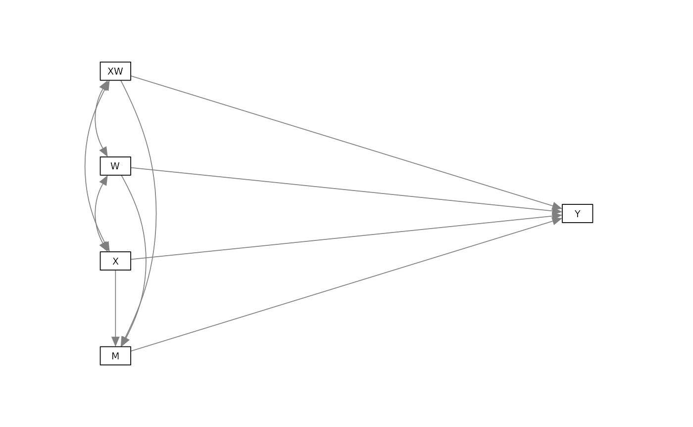

# Moderated mediation and mediated moderation using rmedsem

It is often of interest to assess whether a mediation effect is
invariant across contexts, or whether its strength depends on the level
of another variable. In such cases, the indirect effect of an
independent variable on an outcome via a mediator is moderated by a
third variable (the moderator). These types of effects are often
referred to as moderated mediation or mediated moderation effects
(Preacher et al., 2007).

Currently, `rmedsem` implements moderated mediation and mediated
moderation. Mediated moderation is available for cases corresponding to
“Model 2” from Preacher et al., 2007 shown in the following graph:



Mathematically, this model can be specified as

$$\begin{aligned}
M & {= a_{0} + a_{1}X + a_{2}W + a_{3}(X \times W) + \varepsilon_{M}} \\
Y & {= b_{0} + b_{1}M + b_{2}X + b_{3}(X \times W) + \varepsilon_{Y}}
\end{aligned}$$

where $X$ is the independent variable, $Y$ is the dependent variable,
$M$ is the mediator, and $W$ is the moderator. The interaction term
$X \times W$ is included in the equations for $M$ and $Y$.

To estimate moderated mediation and mediated moderation with `rmedsem`,
we need to specify the model using the [`modsem`](https://modsem.org)
package which allows to estimate structural equation models with
interaction terms using `lavaan`. We specify and estimate the following
model (corresponding to the conceptual model above) using the dataset
[`rmedsem::mchoice`](https://ihrke.github.io/rmedsem/reference/mchoice.md):

``` r
library(modsem)

model <- "
  OwnLook =~ smv_attr_face + smv_attr_body + smv_sexy
  SelfEst =~ ses_satis + ses_qualities + ses_able_todo
  MentWell =~ mwb_optimistic + mwb_useful + mwb_energy
  OwnPers =~ smv_kind + smv_caring + smv_understanding +
    smv_make_laughh + smv_funny + smv_sociable

  MentWell ~ OwnLook + SelfEst + OwnPers + OwnPers:OwnLook
  SelfEst ~ OwnLook + OwnPers + OwnPers:OwnLook
"

est <- modsem(model, data = rmedsem::mchoice, method="lms")
```

## Mediated Moderation

*Mediated moderation* treats the interaction term `X:W` as the
independent variable and asks whether its effect on `Y` is carried
through `M`. In our example, we can test whether the interaction between
`OwnLook` and `OwnPers` on `MentWell` is mediated by `SelfEst`.

``` r
library(rmedsem)
rmedsem(indep="OwnPers:OwnLook", dep="MentWell", med="SelfEst", mod=est)
#> Significance testing of indirect effect (standardized)
#> Model estimated with package 'modsem'
#> Mediation effect: 'OwnPers:OwnLook' -> 'SelfEst' -> 'MentWell'
#> 
#>                             Sobel             Delta       Monte-Carlo
#> Indirect effect           -0.0809           -0.0809           -0.0809
#> Std. Err.                  0.0203            0.0203            0.0200
#> z-value                   -3.9791           -3.9802           -4.0453
#> p-value                  6.92e-05          6.89e-05          5.22e-05
#> CI              [-0.121, -0.0411] [-0.121, -0.0411] [-0.121, -0.0431]
#> 
#> Baron and Kenny approach to testing mediation
#>    STEP 1 - 'OwnPers:OwnLook:SelfEst' (X -> M) with B=-0.155 and p=0.000
#>    STEP 2 - 'SelfEst:MentWell' (M -> Y) with B=0.521 and p=0.000
#>    STEP 3 - 'OwnPers:OwnLook:MentWell' (X -> Y) with B=-0.007 and p=0.822
#>             As STEP 1, STEP 2 and the Sobel's test above are significant
#>             and STEP 3 is not significant the mediation is complete.
#> 
#> Zhao, Lynch & Chen's approach to testing mediation
#> Based on p-value estimated using Monte-Carlo
#>   STEP 1 - 'OwnPers:OwnLook:MentWell' (X -> Y) with B=-0.007 and p=0.822
#>             As the Monte-Carlo test above is significant and STEP 1 is not
#>             significant there indirect-only mediation (full mediation).
#> 
#> Effect sizes
#>    RIT = (Indirect effect / Total effect)
#>          Total effect 0.088 is too small to calculate RIT
#>    RID = (Indirect effect / Direct effect)
#>          (0.081/0.007) = 11.849
#>          That is, the mediated effect is about 11.8 times as
#>          large as the direct effect of 'OwnPers:OwnLook' on 'MentWell'
```

## Moderated Mediation

*Moderated mediation* asks whether the indirect effect of an exposure
`X` on outcome `Y` via mediator `M` varies across levels of a third
variable `W`.  
Using the model from the previous example, we test how the indirect path
from `OwnLook` to `MentWell` through `SelfEst` depends on `OwnPers`.

``` r
rmedsem(indep="OwnLook", dep="MentWell", med="SelfEst", mod=est,
        moderator="OwnPers")
#> Significance testing of indirect effect (standardized)
#> Model estimated with package 'modsem'
#> Mediation effect: 'OwnLook' -> 'SelfEst' -> 'MentWell'
#> 
#>                          Sobel          Delta    Monte-Carlo
#> Indirect effect         0.2532         0.2532         0.2532
#> Std. Err.               0.0287         0.0287         0.0274
#> z-value                 8.8203         8.8085         9.2436
#> p-value                      0              0              0
#> CI              [0.197, 0.309] [0.197, 0.309] [0.201, 0.307]
#> 
#> Baron and Kenny approach to testing mediation
#>    STEP 1 - 'OwnLook:SelfEst' (X -> M) with B=0.486 and p=0.000
#>    STEP 2 - 'SelfEst:MentWell' (M -> Y) with B=0.521 and p=0.000
#>    STEP 3 - 'OwnLook:MentWell' (X -> Y) with B=0.011 and p=0.810
#>             As STEP 1, STEP 2 and the Sobel's test above are significant
#>             and STEP 3 is not significant the mediation is complete.
#> 
#> Zhao, Lynch & Chen's approach to testing mediation
#> Based on p-value estimated using Monte-Carlo
#>   STEP 1 - 'OwnLook:MentWell' (X -> Y) with B=0.011 and p=0.810
#>             As the Monte-Carlo test above is significant and STEP 1 is not
#>             significant there indirect-only mediation (full mediation).
#> 
#> Effect sizes
#>    RIT = (Indirect effect / Total effect)
#>          (0.253/0.265) = 0.957
#>          Meaning that about  96% of the effect of 'OwnLook'
#>          on 'MentWell' is mediated by 'SelfEst'
#>    RID = (Indirect effect / Direct effect)
#>          (0.253/0.011) = 22.233
#>          That is, the mediated effect is about 22.2 times as
#>          large as the direct effect of 'OwnLook' on 'MentWell'
#> 
#> 
#> Direct moderation effects
#>    SelfEst  -> OwnLook  | OwnPers: B = -0.155, se = 0.037, p = 0.000
#>    MentWell -> OwnLook  | OwnPers: B = -0.007, se = 0.030, p = 0.822
#> 
#> Indirect moderation effect
#>    SelfEst  -> OwnLook  | OwnPers: B = -0.081, se = 0.020, p = 0.000
#> 
#> Total moderation effect
#>    SelfEst  -> OwnLook  | OwnPers: B = -0.088, se = 0.034, p = 0.010
```

In this case the difference between a *moderated mediation* and
*mediated moderation* is purely semantic. Indeed, the indirect and total
moderation effect when interpreted as a moderated mediation is the exact
same as the indirect and total effect in the previous example ($.07$ and
$.08$).

That being said, moderated mediations can be more complex in nature than
mediated moderations, where the moderating variable `W` can affect the
paths of model differently. Here we can for example see a moderated
mediation where `OwnPers` not only affects the path from `OwnLook` to
`SelfEst` and `OwnLook` to `MentWell`, but also the path from `SelfEst`
to `MentWell`.

``` r
model2 <- "
  OwnLook =~ smv_attr_face + smv_attr_body + smv_sexy
  SelfEst =~ ses_satis + ses_qualities + ses_able_todo
  MentWell =~ mwb_optimistic + mwb_useful + mwb_energy
  OwnPers =~ smv_kind + smv_caring + smv_understanding +
    smv_make_laughh + smv_funny + smv_sociable

  SelfEst ~ OwnLook + OwnPers + OwnPers:OwnLook
  MentWell ~ OwnLook + SelfEst + OwnPers + OwnPers:OwnLook + OwnPers:SelfEst
"

est2 <- modsem(model2, data = rmedsem::mchoice, method="lms")
```

[`rmedsem()`](https://ihrke.github.io/rmedsem/reference/rmedsem.md) will
automatically detect the paths wich are moderated by the `moderator` and
tailor the output accordingly.

``` r
rmedsem(indep="OwnLook", dep="MentWell", med="SelfEst", mod=est2,
        moderator="OwnPers")
#> Significance testing of indirect effect (standardized)
#> Model estimated with package 'modsem'
#> Mediation effect: 'OwnLook' -> 'SelfEst' -> 'MentWell'
#> 
#>                          Sobel          Delta    Monte-Carlo
#> Indirect effect         0.2501         0.2501         0.2501
#> Std. Err.               0.0284         0.0282         0.0282
#> z-value                 8.8053         8.8564         8.9127
#> p-value                      0              0              0
#> CI              [0.194, 0.306] [0.195, 0.305] [0.197, 0.307]
#> 
#> Baron and Kenny approach to testing mediation
#>    STEP 1 - 'OwnLook:SelfEst' (X -> M) with B=0.487 and p=0.000
#>    STEP 2 - 'SelfEst:MentWell' (M -> Y) with B=0.513 and p=0.000
#>    STEP 3 - 'OwnLook:MentWell' (X -> Y) with B=0.031 and p=0.519
#>             As STEP 1, STEP 2 and the Sobel's test above are significant
#>             and STEP 3 is not significant the mediation is complete.
#> 
#> Zhao, Lynch & Chen's approach to testing mediation
#> Based on p-value estimated using Monte-Carlo
#>   STEP 1 - 'OwnLook:MentWell' (X -> Y) with B=0.031 and p=0.519
#>             As the Monte-Carlo test above is significant and STEP 1 is not
#>             significant there indirect-only mediation (full mediation).
#> 
#> Effect sizes
#>    RIT = (Indirect effect / Total effect)
#>          (0.250/0.281) = 0.890
#>          Meaning that about  89% of the effect of 'OwnLook'
#>          on 'MentWell' is mediated by 'SelfEst'
#>    RID = (Indirect effect / Direct effect)
#>          (0.250/0.031) = 8.110
#>          That is, the mediated effect is about 8.1 times as
#>          large as the direct effect of 'OwnLook' on 'MentWell'
#> 
#> 
#> Direct moderation effects
#>    SelfEst  -> OwnLook  | OwnPers: B = -0.137, se = 0.029, p = 0.000
#>    MentWell -> SelfEst  | OwnPers: B = 0.082, se = 0.045, p = 0.068
#>    MentWell -> OwnLook  | OwnPers: B = -0.085, se = 0.054, p = 0.116
#> 
#> Indirect moderation effect
#>    SelfEst  -> OwnLook  | OwnPers: B = -0.041, se = 0.024, p = 0.082
#> 
#> Total moderation effect
#>    SelfEst  -> OwnLook  | OwnPers: B = -0.126, se = 0.046, p = 0.006
```
