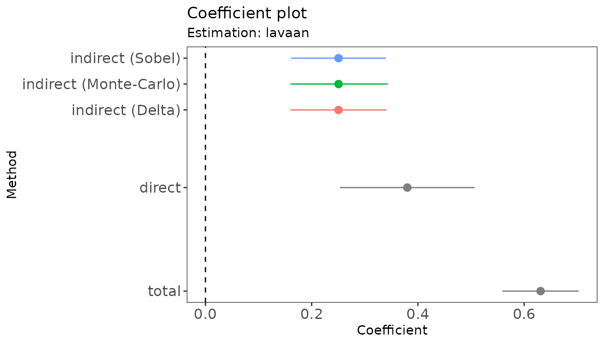
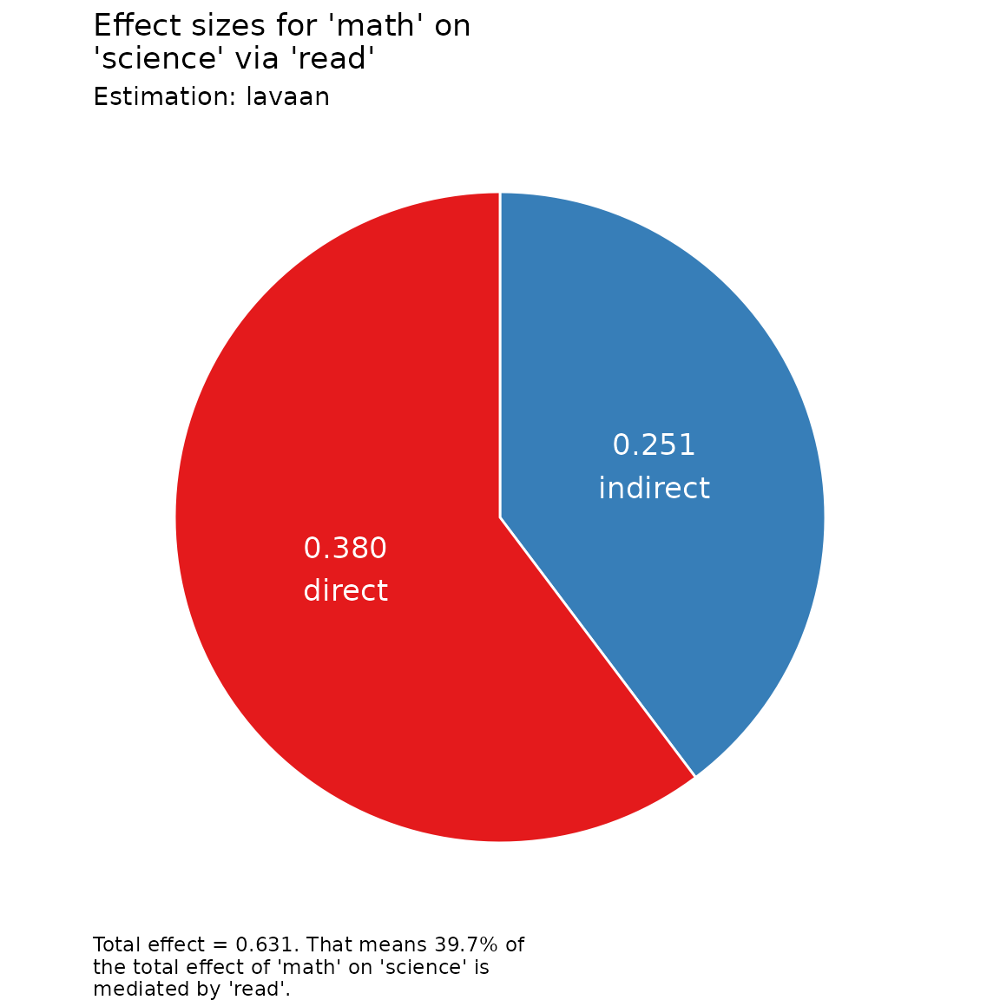

# Working with the results

[`rmedsem()`](https://ihrke.github.io/rmedsem/reference/rmedsem.md)
returns an object of class `rmedsem`. Besides printing it, there are
several functions to summarize the results, extract estimates for
further processing, and visualize them. We use the simple mediation
model from the [Getting
started](https://ihrke.github.io/rmedsem/index.html#getting-started)
section as an example:

``` r

library(rmedsem)

mod.txt <- "
  read ~ math
  science ~ read + math
"
mod <- lavaan::sem(mod.txt, data = hsbdemo)
out <- rmedsem(mod, indep = "math", med = "read", dep = "science")
```

## Detailed output and compact summary

Printing the object gives a detailed, step-by-step description of the
tests of the indirect effect and of the Baron & Kenny and Zhao, Lynch &
Chen approaches:

``` r

out
#> Significance testing of indirect effect (standardized)
#> Model estimated with package 'lavaan'
#> Mediation effect: 'math' -> 'read' -> 'science'
#> 
#>                          Sobel          Delta    Monte-Carlo
#> Indirect effect          0.251          0.251          0.251
#> Std. Err.                0.046          0.046          0.047
#> z-value                  5.501          5.446          5.374
#> p-value               3.79e-08       5.15e-08       7.71e-08
#> CI              [0.161, 0.340] [0.160, 0.341] [0.160, 0.343]
#> 
#> Baron and Kenny approach to testing mediation
#>    STEP 1 - 'math' -> 'read' (X -> M) with B=0.662 and p<0.001
#>    STEP 2 - 'read' -> 'science' (M -> Y) with B=0.378 and p<0.001
#>    STEP 3 - 'math' -> 'science' (X -> Y) with B=0.380 and p<0.001
#>             As STEP 1, STEP 2 and STEP 3 as well as the Sobel's test above
#>             are significant the mediation is partial.
#> 
#> Zhao, Lynch & Chen's approach to testing mediation
#> Based on p-value estimated using Monte-Carlo
#>   STEP 1 - 'math' -> 'science' (X -> Y) with B=0.380 and p<0.001
#>             As the Monte-Carlo test above is significant, STEP 1 is
#>             significant and their coefficients point in same direction,
#>             there is complementary mediation (partial mediation).
#> 
#> Effect sizes
#>    RIT = (Indirect effect / Total effect)
#>          (0.251/0.631) = 0.397
#>          Meaning that about 40% of the effect of 'math'
#>          on 'science' is mediated by 'read'
#>    RID = (Indirect effect / Direct effect)
#>          (0.251/0.380) = 0.659
#>          That is, the mediated effect is about 0.7 times as
#>          large as the direct effect of 'math' on 'science'
#>    Upsilon (v) = Variance in Y explained indirectly by X through M
#>          v(unadj) = 0.063, v(adj) = 0.061
```

[`summary()`](https://rdrr.io/r/base/summary.html) condenses the same
results into a table of the indirect (for each estimation method),
direct and total effects, the resulting type of mediation and the effect
sizes:

``` r

s <- summary(out)
s
#> Mediation analysis: 'math' -> 'read' -> 'science'
#> Estimated with 'lavaan' (standardized), N = 200
#> 
#> Effects (95% CI):
#>                        Estimate Std. Err. z-value  p-value Lower Upper
#> Indirect (Sobel)          0.251     0.046   5.501 3.79e-08 0.161 0.340
#> Indirect (Delta)          0.251     0.046   5.446 5.15e-08 0.160 0.341
#> Indirect (Monte-Carlo)    0.251     0.047   5.374 7.71e-08 0.160 0.343
#> Direct                    0.380     0.065         4.43e-09 0.253 0.507
#> Total                     0.631     0.037                  0.559 0.703
#> 
#> Type of mediation (significant: p < 0.05):
#>   Baron & Kenny:      partial mediation
#>   Zhao, Lynch & Chen: complementary mediation (partial mediation)
#>                       (based on Monte-Carlo test)
#> 
#> Effect sizes:
#>   RIT = 0.397
#>   RID = 0.659
#>   Upsilon = 0.061
#>   Upsilon (unadj.) = 0.063
```

The summary is itself an object whose elements can be used in further
analyses, e.g., the type of mediation or the table of effects:

``` r

s$mediation
#> $bk
#> [1] "partial"
#> 
#> $zlc
#> [1] "complementary"
s$effects
#>     effect method  estimate         se     zval         pval     lower
#> 1 indirect  sobel 0.2506159 0.04556196 5.500552 3.786031e-08 0.1613161
#> 2 indirect  delta 0.2506159 0.04601847 5.445986 5.151917e-08 0.1604214
#> 3 indirect  montc 0.2506159 0.04669944 5.373859 7.706911e-08 0.1602372
#> 4   direct   <NA> 0.3801172 0.06478771       NA 4.434311e-09 0.2531357
#> 5    total   <NA> 0.6309719 0.03730960       NA           NA 0.5588379
#>       upper
#> 1 0.3399157
#> 2 0.3408105
#> 3 0.3433785
#> 4 0.5070988
#> 5 0.7028962
```

## Extracting estimates

The standard extractor functions
[`coef()`](https://rdrr.io/r/stats/coef.html),
[`confint()`](https://rdrr.io/r/stats/confint.html) and
[`nobs()`](https://rdrr.io/r/stats/nobs.html) work for `rmedsem`
objects:

``` r

coef(out)
#>  indirect    direct     total 
#> 0.2506159 0.3801172 0.6309719
confint(out)
#>              2.5 %    97.5 %
#> indirect 0.1602372 0.3433785
#> direct   0.2531357 0.5070988
#> total    0.5588379 0.7028962
nobs(out)
#> [1] 200
```

The indirect effect is estimated with several methods (here Sobel, Delta
and Monte-Carlo). They share the same point estimate but differ in their
standard errors and intervals. By default,
[`coef()`](https://rdrr.io/r/stats/coef.html) and
[`confint()`](https://rdrr.io/r/stats/confint.html) use the method that
also underlies the Zhao, Lynch & Chen approach (Monte-Carlo for `lavaan`
and `modsem`, bootstrap for `cSEM`, and the posterior for `blavaan`).
Use the `method` argument to choose a different one:

``` r

confint(out, parm = "indirect", method = "sobel")
#>              2.5 %    97.5 %
#> indirect 0.1613161 0.3399157
```

The level of all intervals is set when calling
[`rmedsem()`](https://ihrke.github.io/rmedsem/reference/rmedsem.md) with
the `ci.two.tailed` argument:

``` r

out90 <- rmedsem(mod, indep = "math", med = "read", dep = "science",
                 ci.two.tailed = 0.90)
confint(out90)
#>                5 %      95 %
#> indirect 0.1749096 0.3287469
#> direct   0.2735509 0.4866835
#> total    0.5674115 0.6933806
```

[`as.data.frame()`](https://rdrr.io/r/base/as.data.frame.html) returns
the estimates of the indirect effect for all methods as a data frame:

``` r

as.data.frame(out)
#>   package method      coef         se     zval         pval     lower     upper
#> 1  lavaan  sobel 0.2506159 0.04556196 5.500552 3.786031e-08 0.1613161 0.3399157
#> 2  lavaan  delta 0.2506159 0.04601847 5.445986 5.151917e-08 0.1604214 0.3408105
#> 3  lavaan  montc 0.2506159 0.04669944 5.373859 7.706911e-08 0.1602372 0.3433785
```

## Effect sizes

The effect sizes are available through dedicated functions:

``` r

RIT(out)      # ratio of indirect to total effect
#> [1] 0.3973407
RID(out)      # ratio of indirect to direct effect
#> [1] 0.6593122
Upsilon(out)  # variance in 'science' explained indirectly by 'math' via 'read'
#> [1] 0.06073778
Upsilon(out, adjusted = FALSE)
#> [1] 0.06280834
```

## Plots

[`plot()`](https://rdrr.io/r/graphics/plot.default.html) shows a
coefficient plot of the indirect (for each method), direct and total
effects, or a pie chart of the indirect and direct effects:

``` r

plot(out)
```



``` r

plot(out, type = "effect")
```



## Bayesian models: equal-tailed intervals or HDI

For models estimated with `blavaan`, the intervals are credible
intervals computed from the posterior samples. By default, these are
equal-tailed intervals (the 2.5% and 97.5% quantiles for
`ci.two.tailed = 0.95`). Set `hdi = TRUE` to obtain highest density
intervals (HDI) instead, which requires the
[HDInterval](https://cran.r-project.org/package=HDInterval) package:

``` r

library(blavaan)
bmod <- bsem(mod.txt, data = hsbdemo, n.chains = 3, burnin = 500, sample = 500,
             seed = 1, bcontrol = list(cores = 3, refresh = 0))
```

``` r

out.ci  <- rmedsem(bmod, indep = "math", med = "read", dep = "science")
out.hdi <- rmedsem(bmod, indep = "math", med = "read", dep = "science",
                   hdi = TRUE)

confint(out.ci)
#>              2.5 %    97.5 %
#> indirect 0.1612465 0.3453186
#> direct   0.2419574 0.5018078
#> total    0.5455176 0.6975530
confint(out.hdi)
#>              lower     upper
#> indirect 0.1578379 0.3412939
#> direct   0.2404421 0.4997919
#> total    0.5539862 0.7042719
summary(out.hdi)
#> Mediation analysis: 'math' -> 'read' -> 'science'
#> Estimated with 'blavaan' (standardized), N = 200
#> 
#> Effects (95% HDI):
#>                  Estimate Std. Err. z-value p-value Lower Upper
#> Indirect (Bayes)    0.250     0.047   5.292   0.000 0.158 0.341
#> Direct              0.378     0.066           0.000 0.240 0.500
#> Total               0.629     0.039                 0.554 0.704
#> For Bayesian estimates, 'p-value' is the posterior probability of
#> the opposite sign.
#> 
#> 
#> Effect sizes:
#>   RIT = 0.398
#>   RID = 0.661
#>   Upsilon = 0.060
#>   Upsilon (unadj.) = 0.063
```
